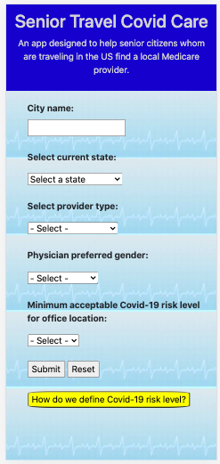

# project-1

Welcome to Senior Travel Covid Care Application!
The state of today's public health environment was the inspiration for our application of Senior Travel Covid Care. Our application's target demographic is senior citizens who are traveling (e.g. snowbirds, visiting children out-of-state) and may have been exposed or developed symptoms of COVID-19 and need to find a physician that accepts medicare. Users are able to search for their city and state, physician type, preferred physician gender, and acceptable Covid-risk level for their state. A goal of this application was to be as user-friendly as possible with our target user in mind.

URL of deployed app: 

- [Installation](#installation)
- [Usage](#usage)
- [Credits](#credits)
- [License](#license)

## Installation

Clone my Github repository to your local machine: https://github.com/Bhargava82/project-1

## Usage

1. Open webpage in browser: https://bhargava82.github.io/project-1/
2. Provide the following inputs:
    a. current city
    b. state
    c. physician type (specialization)
    d. preferred gender of physician
    e. acceptable risk level (low, medium, high)
3. Click the submit button and page will refresh to a result page listing containing physicians that meet your search criteria.
4. If too many results return, you can limit the listing by using the drop down menu near the top of the page.
5. Click 'New Search' in the Navbar to return to initial page and start over.

## Credits

W3C Schools HTML JavaScript: https://www.w3schools.com/js/default.asp
MDN web docs JavaScript: https://developer.mozilla.org/en-US/docs/Web/JavaScript
Bootstrap components: https://getbootstrap.com/docs/4.5/getting-started/introduction
NPPES NPI Registry API: https://npiregistry.cms.hhs.gov/registry/help-api
Rapid API COVID-19 Statistics API: https://rapidapi.com/axisbits-axisbits-default/api/covid-19-statistics
Google Maps dynamic URL usage: https://developers.google.com/maps/documentation

## License

MIT License

Copyright (c) [2020] [Senior Travel Covid Care Team: Justin Sykes, Beth Presten, Bhargava Patel, Josepth Strickland]

Permission is hereby granted, free of charge, to any person obtaining a copy
of this software and associated documentation files (the "Software"), to deal
in the Software without restriction, including without limitation the rights
to use, copy, modify, merge, publish, distribute, sublicense, and/or sell
copies of the Software, and to permit persons to whom the Software is
furnished to do so, subject to the following conditions:

The above copyright notice and this permission notice shall be included in all
copies or substantial portions of the Software.

THE SOFTWARE IS PROVIDED "AS IS", WITHOUT WARRANTY OF ANY KIND, EXPRESS OR
IMPLIED, INCLUDING BUT NOT LIMITED TO THE WARRANTIES OF MERCHANTABILITY,
FITNESS FOR A PARTICULAR PURPOSE AND NONINFRINGEMENT. IN NO EVENT SHALL THE
AUTHORS OR COPYRIGHT HOLDERS BE LIABLE FOR ANY CLAIM, DAMAGES OR OTHER
LIABILITY, WHETHER IN AN ACTION OF CONTRACT, TORT OR OTHERWISE, ARISING FROM,
OUT OF OR IN CONNECTION WITH THE SOFTWARE OR THE USE OR OTHER DEALINGS IN THE
SOFTWARE.
